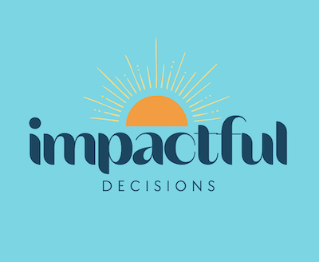
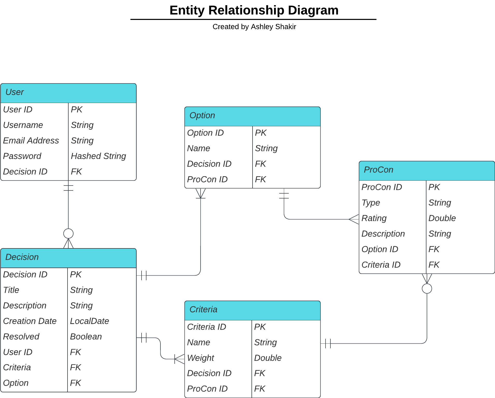

# Impactful Decisions



## Project Description

Impactful Decisions is a web-based application designed to empower users to make informed and meaningful choices. In a world filled with countless decisions, this platform provides a structured framework for decision-making, allowing users to define decisions, list criteria, compare options, and analyze pros and cons to arrive at the best possible choice.
I believe that every choice you make shapes your journey, and this application is dedicated to ensuring those choices are impactful and aligned with your goals.

# Table of Contents

1. [Impactful Decisions](#impactful-decisions)
   - [Project Description](#project-description)
2. [Project Goals](#project-goals)
3. [Project Approach](#project-approach)
   - [1. Planning and Project Documentation](#1-planning-and-project-documentation)
     - [GitHub Project Board](#github-project-board)
     - [User-Centric Design](#user-centric-design)
     - [Entity-Relationship Diagram (ERD)](#entity-relationship-diagram-erd)
     - [REST API Endpoints](#rest-api-endpoints)
   - [2. Backend Development (Spring Boot)](#2-backend-development-spring-boot)
   - [3. Frontend Development (Angular)](#3-frontend-development-angular)
   - [4. User Experience Enhancement](#4-user-experience-enhancement)
   - [Comprehensive Testing](#comprehensive-testing)
4. [Tools and Technologies Used](#tools-and-technologies-used)
5. [Challenges During Development](#challenges-during-development)
6. [Installation Instructions](#installation-instructions)
7. [Acknowledgements](#acknowledgements)
   - [General Assembly Instructors](#general-assembly-instructors)
   - [Project Lead and Developer](#project-lead-and-developer)
9. [Conclusion](#conclusion)


## Project Goals

1. **Empowerment:** Enable users to make informed and impactful decisions aligned with their goals.

2. **User-Friendly:** Create an intuitive and user-friendly interface for ease of use.

3. **Structured Decision-Making:** Provide a step-by-step decision-making process, including defining decisions, criteria, options, and analysis.

4. **Authentication:** Implement user registration and login features to personalize the experience.

## Project Approach

### 1. Planning and Project Documentation

- **Objective:** Establish project boundaries, deliverables, and schedules while leveraging GitHub Projects for seamless project management.
- **Tasks:** 
  - Draft detailed application user stories.
  - Construct an Entity Relationship Diagram (ERD).
  - Compile a table outlining API endpoints.
  - Initiate and configure a GitHub project board for task tracking.
- **Timeline:** October 18, 2023 

#### GitHub Project Board

I have utilized GitHub Projects as a resource for project planning and management. You can view the project board [here](https://github.com/users/ashleyshakir/projects/5). Below is a screenshot of the GitHub project board as of October 19, 2023:


#### User-Centric Design
<details>
<summary>Backend User Stories</summary>

- **User Registration:** As a user, I can register an account, providing my username, email address, and password, so that I can access the application.

- **User Login:** As a user, I can log in to my account using my email address and password, so that I can access my personalized dashboard.

- **Create Decision:** As a user, I can create a new decision, specifying a title and description for the decision, so that I can make informed choices.

- **Delete Decision:** As a user, I can delete a decision, removing all criteria, options, and pros and cons associated with it, in case I no longer need it.

- **Define Criteria:** As a user, I can define criteria for my decision, including the name and weight of each criterion, to tailor the evaluation process to my needs.

- **Add Options:** As a user, I can add options for my decision, providing names for each option, to consider various possibilities.

- **List Pros and Cons:** As a user, I can list pros and cons for each option, associating them with criteria and assigning ratings, for a comprehensive evaluation.

- **Update Decision:** As a user, I can edit an existing decision, allowing me to modify any aspects of it such as its title, description, options, criteria, pros, cons, etc., to keep my choices up to date.

- **Calculate and View Analysis:** As a user, I can calculate and view the analysis of my decision, including the score for each option and a recommendation, to make an informed choice.

</details>


#### Entity-Relationship Diagram (ERD)

To model the data structure effectively, I've created an Entity-Relationship Diagram (ERD). This visual representation maps out the relationships between different entities in the system, such as users, decisions, and criteria, options, and pros and cons. The ERD serves as a blueprint for the database design, ensuring that data is organized and structured efficiently.



#### REST API Endpoints

<details>
  <summary><b>API Endpoints</b></summary>
  
  | Endpoint                        | Request Type | URL                                                       | Functionality                                 | Access  |
  |---------------------------------|--------------|-----------------------------------------------------------|-----------------------------------------------|---------|
  | **User Registration**           | POST         | `/auth/users/register/`                                   | Create a new user account                     | Public  |
  | **User Login**                  | POST         | `/auth/users/login/`                                      | Authenticate and log in a user                | Public  |
  | **Create a Decision**           | POST         | `/api/decisions/`                                         | Create a new decision                         | Private |
  | **Get Decision by id**          | GET          | `/api/decisions/{decisionId}/`                            | Retrieve a specific decision by its id        | Private |
  | **Get All Decisions**           | GET          | `/api/decisions/`                                         | Retrieve a list of all decisions              | Private |
  | **Update Decision**             | PUT          | `/api/decisions/{decisionId}/`                            | Update an existing decision                   | Private |
  | **Delete Decision**             | DELETE       | `/api/decisions/{decisionId}/`                            | Delete a specific decision by its id          | Private |
  | **Add Criteria to a Decision**  | POST         | `/api/decisions/{decisionId}/criteria/`                   | Add a new criterion to a specific decision    | Private |
  | **Get All Criteria**            | GET          | `/api/decisions/{decisionId}/criteria/`                   | Retrieve a list of all criteria               | Private |
  | **Update Criteria**             | PUT          | `/api/decisions/{decisionId}/criteria/{criterionId}/`     | Update an existing criterion                  | Private |
  | **Delete Criteria**             | DELETE       | `/api/decisions/{decisionId}/criteria/{criterionId}/`     | Delete a specific criterion by its id         | Private |
  | **Add Option to a Decision**    | POST         | `/api/decisions/{decisionId}/options/`                    | Add a new option to a specific decision       | Private |
  | **Get All Options**             | GET          | `/api/decisions/{decisionId}/options/`                    | Retrieve a list of all options                | Private |
  | **Update Option**               | PUT          | `/api/decisions/{decisionId}/options/{optionId}/`         | Update an existing option                     | Private |
  | **Delete Option**               | DELETE       | `/api/decisions/{decisionId}/options/{optionId}/`         | Delete a specific option by its id            | Private |
  | **Add Pro or Con to an Option** | POST         | `/api/decisions/{decisionId}/options/{optionId}/procons/` | Add a new pro or con to a specific option     | Private |
  | **Get all Pros and Cons**       | GET          | `/api/decisions/{decisionId}/options/{optionId}/procons/` | Retrieve all pros and cons belonging to an option | Private |
  | **Update Pro or Con**           | PUT          | `/api/decisions/{decisionId}/options/{optionId}/procons/{proconId}/` | Update an existing pro or con             | Private |
  | **Delete Pro or Con**           | DELETE       | `/api/decisions/{decisionId}/options/{optionId}/procons/{proconId}/` | Delete a specific pro or con by its id    | Private |
  | **Get Analysis Results**        | GET          | `/api/decisions/{decisionId}/recommendation/`             | Retrieve the analysis results for a decision  | Private |

</details>


### 2. Backend Development (Spring Boot)

- **Objective:** Create the backend infrastructure for the application.
- **Tasks:** 
  - Develop user management functionalities including registration and login.
  - Design and implement CRUD operations for all application models.
  - Conduct unit tests on service methods and carry out integration tests for API endpoints.
  - Implement and ensure user authentication and authorization mechanisms.
- **Timeline:** October 18, 2023 - October 20, 2023

### 3. Frontend Development (Angular)

- **Objective:** Develop the user interface for the Impactful Decisions Application.
- **Tasks:** 
  - Create user registration and login interfaces. 
  - Implement authentication and JWT token handling. 
  - Design the user dashboard for decision management.
  - Build a wizard-like decision creation interface.
- **Timeline:** October 20, 2023 - October 26, 2023
- **Frontend GitHub Repository** You can view the frontend repository [here](https://github.com/ashleyshakir/frontend-impactful-decisions.git).

### 4. User Experience Enhancement

- **Objective:** Enhance the user interface and overall user experience.
- **Tasks:**  
  - Implement responsive design for both mobile and desktop.
  - Improve UI/UX through intuitive navigation and cohesive visuals.
  - Integrate customized dialog boxes to provide clear user prompts and messages, elevating the interaction quality.
- **Timeline:** October 25, 2023 - October 26, 2023

### Comprehensive Testing

To maintain code quality and reliability, I've integrated Cucumber with Rest Assured testing into the development process. I performed extensive testing, including public and protected endpoint testing, token testing, and thorough unit testing of service and controller components.

## Tools and Technologies Used

- **IntelliJ IDEA/Java 17:** IDE used in conjunction with Java SDK.
  - **Maven:** Powerful build automation tool and dependency management framework for Java projects.
- **Postman:** API platform for building and using APIs.
- **Spring Boot:** [Version 2.7.16](https://mvnrepository.com/artifact/org.springframework.boot/spring-boot-starter-parent/2.7.16) Powers the backend.
  - **Tomcat Server:** Hosts the application.
  - **Spring Security:** Ensures data security.
  - **Spring RESTful API:** Offers user-friendly interaction.
  - **MVC Architecture:** Follows a clean code structure.
- **H2 Database:** Manages data storage.
- **JWT Tokens:** [Version 0.11.5](https://mvnrepository.com/artifact/io.jsonwebtoken/jjwt-api/0.11.5) Provides authentication and authorization.
- **Cucumber JVM:** [Version 6.8.1](https://mvnrepository.com/artifact/io.cucumber/cucumber-java/6.8.1) Testing framework that supports Behavior Driven Development.
- **REST Assured:** [Version 4.3.0](https://mvnrepository.com/artifact/io.rest-assured/rest-assured/4.3.0) Java library that provides a domain-specific language for writing powerful, maintainable test for RESTful APIs.
- **SpringDoc OpenAPI** [Version 1.7.0](https://springdoc.org/v1/#getting-startedGenerates) OpenAPI documentation for API endpoints.
  - **Swagger UI** Interactive user interface for exploring and testing API.
- **Documentation:** Well-documented codebase.
- **GitHub:** Version control and collaboration platform.

## Challenges During Development

<details>
<summary><strong>Challenge:</strong> Refactoring Controller Endpoints</summary>
<br>
A hurdle I encountered during development was the need to refactor my controller endpoints for Options and Criteria. Initially, they were designed to accept requests with a single Criteria or Option, but I realized I needed to modify them to handle requests with arrays of Criteria and Options.

<br>To address this challenge, I made changes to my controller endpoints to allow incoming requests to include arrays of Criteria and Options. This modification ensured that the API could efficiently process and manage multiple Criteria and Options in a single request, streamlining the decision-making process for users.

</details>
<details>
<summary><strong>Challenge:</strong> Implementing Decision Analysis Logic</summary>
<br>
Implementing the decision analysis logic, including calculating option scores based on criteria weights and ratings, was complex and required thorough testing. Initially, the calculations could result in negative values, which wouldn't be meaningful or suitable for displaying to the user.

<br>To address this challenge, I implemented an offset mechanism to ensure that option scores would always be positive and within a suitable range for display. By applying this offset, I was able to guarantee that the scores provided valuable insights to users and could be effectively visualized in the pie chart, enhancing the overall user experience.

</details>
<details>
<summary><strong>Challenge:</strong> Connection Between ProCon and Criteria Models</summary>
<br>
Another challenge I encountered was related to the connection between the ProCon and Criteria models. When adding a ProCon to an option, I successfully associated it with a criteria by sending the criteria name through a request parameter. However, when updating a pro or con, the criteria ID would become null because the update ProCon endpoint wasn't sending the criteria name through the request.

<br> To address this issue, I refactored the update ProCon endpoint to accept not only the ProCon data but also the criteria name as part of the request. This adjustment ensured that the association between ProCons and Criteria remained intact, even during updates, and maintained the integrity of the data model throughout the application.

</details>


## Installation Instructions

To get started using Impactful Decisions, follow these steps:

1. **Install Maven:** Make sure you have Maven installed on your system. You can check if it's installed by running the following command in your terminal or command prompt:

   ```bash
   mvn -v
   ```

   If Maven is not installed, you can download and install it from the official [Apache Maven](https://maven.apache.org/download.cgi) website.

2. Navigate to the root directory of your project, where your pom.xml file is located.
3. Open a terminal or command prompt in this directory and run the following Maven command to download and install the project dependencies:

   ```bash
   mvn clean install
   ```

   This command will instruct Maven to resolve all the dependencies listed in your pom.xml file and download them from the central Maven repository. It will also build your project.

4. Once the command completes successfully, your project should be ready with all its dependencies installed.

## Acknowledgements

### General Assembly Instructors

- Suresh Sigera: [GitHub](https://github.com/sureshmelvinsigera)
- Dhrubo Chowdhury: [GitHub](https://github.com/Dhrubo-Chowdhury)
- Leonardo Rodriguez: [GitHub](https://github.com/LRodriguez92)

### Project Lead and Developer

- Ashley Shakir: [GitHub](https://github.com/ashleyshakir) | [LinkedIn](https://www.linkedin.com/in/ashleymshakir/)


## Conclusion  🎉

Hey there! If you've made it this far, thanks for diving deep into the backend of my decision-making app. I've worked hard to ensure that this API is robust and reliable, ready to be paired with any front-end framework or service out there!

A lot of cups of coffee and brainstorming sessions have gone into creating and optimizing this backend. I believe that a strong foundation on the backend paves the way for an even better user experience on the front end. And while I am super proud of what I have achieved, I'm always open to feedback and suggestions. After all, coding is a journey, not a destination.

Happy coding, and remember: Life is a matter of choices, and every choice you make makes you. If you're ever stuck deciding, well, you know which app to use!

P.S. If you're working on connecting this backend with a front end or just have questions, feel free to reach out ☺️

