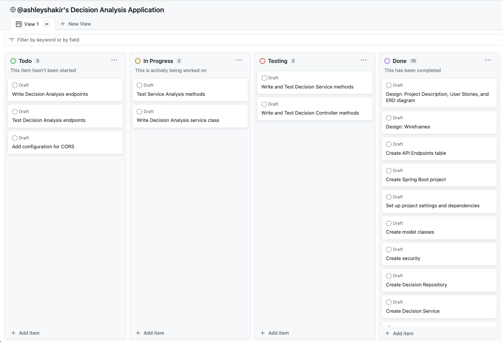

# Impactful Decisions


## Project Description

Impactful Decisions is a web-based application designed to empower users to make informed and meaningful choices. In a world filled with countless decisions, this platform provides a structured framework for decision-making, allowing users to define decisions, list criteria, compare options, and analyze pros and cons to arrive at the best possible choice.

I believe that every choice you make shapes your journey, and this application is dedicated to ensuring those choices are impactful and aligned with your goals.

## Project Goals

1. **Empowerment:** Enable users to make informed and impactful decisions aligned with their goals.

2. **User-Friendly:** Create an intuitive and user-friendly interface for ease of use.

3. **Structured Decision-Making:** Provide a step-by-step decision-making process, including defining decisions, criteria, options, and analysis.

4. **Authentication:** Implement user registration and login features to personalize the experience.

## Project Approach

### 1. Planning and Project Documentation

- **Objective:** Define the project scope, deliverables, and timelines. Utilize GitHub Projects for project management.
- **Tasks:** Create application user stories, design ERD diagram, define project scope, and set timelines. Set up a GitHub project board for tracking tasks.
- **Timeline:** October 18, 2023 - October 27, 2023

#### GitHub Project Board

I have utilized GitHub Projects as a resource for project planning and management. You can view the project board [here](https://github.com/users/ashleyshakir/projects/5). Below is a screenshot of the GitHub project board as of October 19, 2023:



#### User-Centric Design

| User Story                      | Description                                                                                                                    |
| ------------------------------- | ------------------------------------------------------------------------------------------------------------------------------ |
| **User Registration**           | As a user, I want to register an account, providing my username, email address, and password.                                  |
| **User Login**                  | As a user, I want to log in to my account using my email address and password.                                                 |
| **Create Decision**             | As a user, I want to create a new decision, specifying a title and description for the decision.                               |
| **Delete Decision**             | As a user, I want to delete a decision, removing all criteria, options, and pros and cons associated with it.                  |
| **Define Criteria**             | As a user, I want to define criteria for my decision, including the name and weight of each criterion.                         |
| **Add Options**                 | As a user, I want to add options for my decision, providing names for each option.                                             |
| **List Pros and Cons**          | As a user, I want to list pros and cons for each option, associating them with criteria and assigning ratings.                 |
| **Calculate and View Analysis** | As a user, I want to calculate and view the analysis of my decision, including the score for each option and a recommendation. |

#### Entity-Relationship Diagram (ERD)

To model the data structure effectively, I've created an Entity-Relationship Diagram (ERD). This visual representation maps out the relationships between different entities in the system, such as users, decisions, and criteria, options, and pros and cons. The ERD serves as a blueprint for the database design, ensuring that data is organized and structured efficiently.


#### REST API Endpoints

Will add after frontend is completed...

### 2. Backend Development (Spring Boot)

- **Objective:** Create the backend infrastructure for the application.
- **Tasks:** Develop user management features (registration and login), design and implement decision, criteria, and option APIs, create endpoints for adding and analyzing decisions, and ensure user authentication and authorization.
- **Timeline:** October 18, 2023 - October 20, 2023

### 3. Frontend Development (Angular)

- **Objective:** Develop the user interface for the Decision Maker Application.
- **Tasks:** Create user registration and login interfaces, implement authentication and JWT token handling, design the user dashboard for decision management, and build a wizard-like decision creation interface.
- **Timeline:** October 20, 2023 - October 26, 2023
- **Frontend GitHub Repository** You can view the frontend repository [here](insert-link-to-repo).

### 4. User Experience Enhancement

- **Objective:** Enhance the user interface and overall user experience.
- **Tasks:** Implement responsive design for both mobile and desktop, improve UI/UX, address user feedback, and optimize application performance.
- **Timeline:** [Start Date] - [End Date]

### Comprehensive Testing

To maintain code quality and reliability, I've integrated Cucumber with Rest Assured testing into the development process. I performed extensive testing, including public and protected endpoint testing, token testing, and thorough unit testing of service and controller components.

## Tools and Technologies Used

- **IntelliJ IDEA/Java 17:** IDE used in conjunction with Java SDK.
  - **Maven:** Powerful build automation tool and dependency management framework for Java projects.
- **Postman:** API platform for building and using APIs.
- **Spring Boot:** [Version 2.7.16](https://mvnrepository.com/artifact/org.springframework.boot/spring-boot-starter-parent/2.7.16) Powers the backend.
  - **Tomcat Server:** Hosts the application.
  - **Spring Security:** Ensures data security.
  - **Spring RESTful API:** Offers user-friendly interaction.
  - **MVC Architecture:** Follows a clean code structure.
- **H2 Database:** Manages data storage.
- **JWT Tokens:** [Version 0.11.5](https://mvnrepository.com/artifact/io.jsonwebtoken/jjwt-api/0.11.5) Provides authentication and authorization.
- **Cucumber JVM:** [Version 6.8.1](https://mvnrepository.com/artifact/io.cucumber/cucumber-java/6.8.1) Testing framework that supports Behavior Driven Development.
- **REST Assured:** [Version 4.3.0](https://mvnrepository.com/artifact/io.rest-assured/rest-assured/4.3.0) Java library that provides a domain-specific language for writing powerful, maintainable test for RESTful APIs.
- **SpringDoc OpenAPI** [Version 1.7.0](https://springdoc.org/v1/#getting-startedGenerates) OpenAPI documentation for API endpoints.
  - **Swagger UI** Interactive user interface for exploring and testing API.
- **Documentation:** Well-documented codebase.
- **GitHub:** Version control and collaboration platform.

## Installation Instructions

To get started using Impactful Decisions, follow these steps:

1. **Install Maven:** Make sure you have Maven installed on your system. You can check if it's installed by running the following command in your terminal or command prompt:

   ```bash
   mvn -v
   ```

   If Maven is not installed, you can download and install it from the official [Apache Maven](https://maven.apache.org/download.cgi) website.

2. Navigate to the root directory of your project, where your pom.xml file is located.
3. Open a terminal or command prompt in this directory and run the following Maven command to download and install the project dependencies:

   ```bash
   mvn clean install
   ```

   This command will instruct Maven to resolve all the dependencies listed in your pom.xml file and download them from the central Maven repository. It will also build your project.

4. Once the command completes successfully, your project should be ready with all its dependencies installed.

## Resources & Acknowledgements

### General Assembly Instructors

- Suresh Sigera: [GitHub](https://github.com/sureshmelvinsigera)
- Dhrubo Chowdhury: [GitHub](https://github.com/Dhrubo-Chowdhury)
- Leonardo Rodriguez: [GitHub](https://github.com/LRodriguez92)

### Links

-
-
-

## Project Lead and Developer

- Ashley Shakir: [GitHub](https://github.com/ashleyshakir) | [LinkedIn](https://www.linkedin.com/in/ashleymshakir/)

## Conclusion

The Decision Maker Application is a transformative project aimed at helping individuals make impactful choices in their lives. The planning and project documentation phase, including the use of GitHub Projects, has been instrumental in organizing and managing the project effectively.
